# School District Analysis

## Overview: 
This analysis project was performed to modify an earlier analysis of school district student data, which included writing Python code to analyze math and reading scores, school size, budget and school type for a dataset of over 39,000 students across 15 schools in a School District.  For this analysis project, a subset of student data (all of the math and reading scores from Thomas High School 9th graders) was removed per the school board's request, and we repeated the analysis, modifying the code to recalculate the student math and reading score metrics as well as summary data, without some specific student data. The purpose of removing the specific student data is to give the school board a clearer picture of score performance and summary metrics without data they consider may be have been altered, and may not be reliable. This is an exercise in using python code to analyze data, creating summary tables as well as practicing how to work with missing or unreliable data to produce valuable analysis and find insight when datasets are less than ideal.

## Resources

#### Data source provided: 
* schools_complete.csv 
* students_complete.csv

#### Software utilized: 
* Python Version 3.7.7
* Jupyter Notebooks 6.03
* Anaconda 4.8.4

## Results: 

After completing the original analysis by writing Python code to create summary tables for the District's student math and reading scores, as well as school size, budget and school type, we modified the code per the Board's request. To modify the Python code to remove the Thomas High School 9th grade student math and reading scores, we replaced these students' scores with the "NaN" data type, 

**Sample Thomas High School student data**
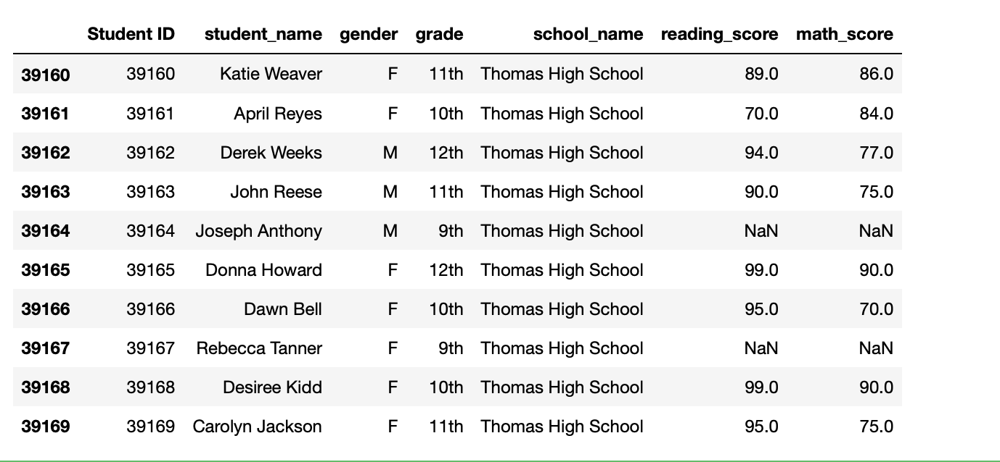  
so that these scores do not factor into the analysis.  The removed group totalled 461 students, 

**Code showing variable created to count Thomas High School 9th graders**
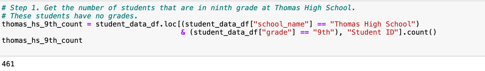 

which brings the total student count across all schools down to 38,709 from 39,170

**Code that removes 9th graders from student count**
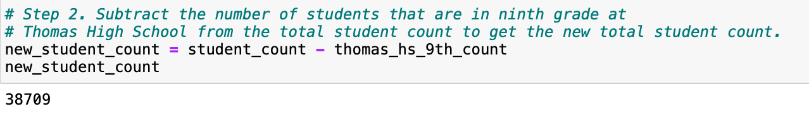 

* The District Summary shows that removing Thomas High School 9th graders' scores lowers Average Math Score across the District from 79.0 to 78.9. The percentage of students Passing Math drops from 75.0 to 74.8, the percentage Passing Reading drops from 85.8 to 85.7 and the percentage Overall Passing drops from 65.2 to 64.9

**Original District Summary**
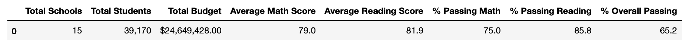 

**Modified District Summary**
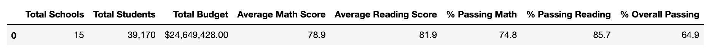 

* The School Summary table shows some much larger effect from having removed the Thomas High School 9th graders on Thomas High School results. Average math and reading scores at Thomas High School dropped a few basis points, while the percentage of students passing math and reading dropped by around 25 percentage points. 

    * Average Math Scores: Decrease from 83.41 to 83.35
    * Average Reading Scores: Increase from 83.83 to 83.89
    * % Passing Math: Large decrease from 93.27 to 66.91
    * % Passing Reading: Large decrease from 97.30 to 69.66
    * %Overall Passing: Large decrease from 90.94 to 65.07

**Original School Summary**
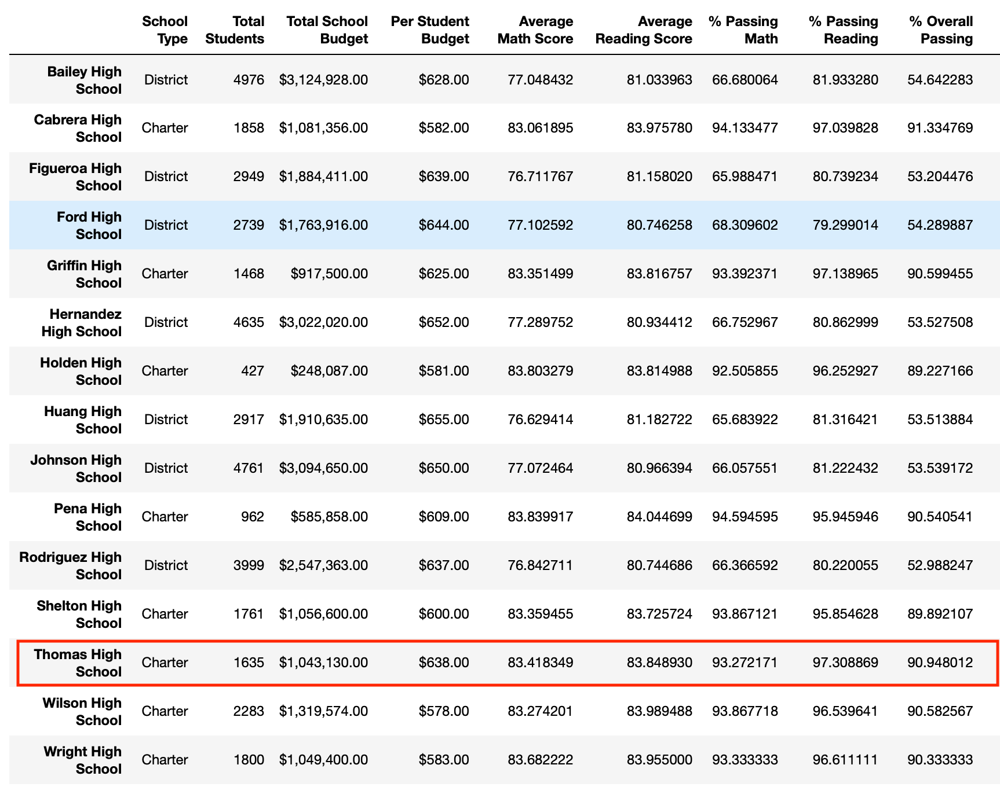 

**Modified School Summary**
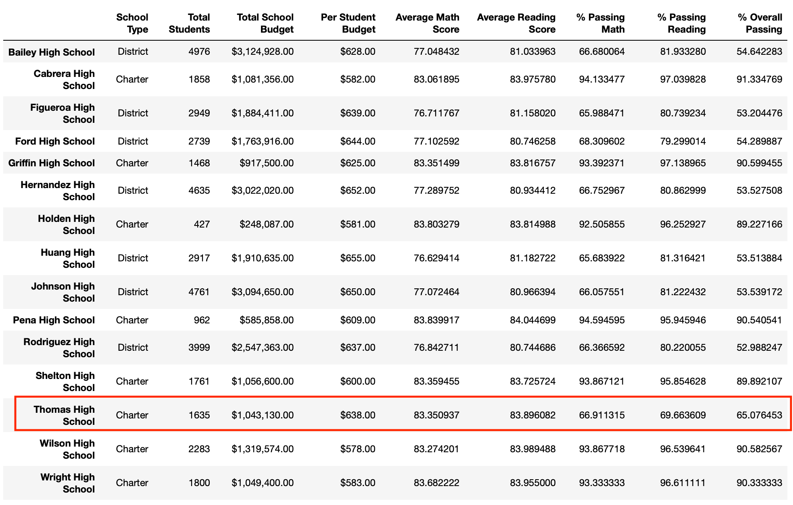 

* Comparing the modified data analysis to the original analysis shows that Thomas High School's student performance dropped significantly. The percentages of students passing math, reading or passing both decreased by about 25% which indicates the 9th grader's scores really moved those metrics higher for the school before the modification.

* Replacing the Thomas High School 9th grader scores only has an effect on the math and reading scores tables for Thomas High School. The Scores by School Spending Rnages, School Size and School Type are unchanged after the modifications to the code:

    * Math and reading scores by grade are unaffected for all schools and students, other than those for 9th graders at Thomas High School, whose scores have been removed and replaced with the 'not a number' variable.

        **Original Math Scores by Grade**
        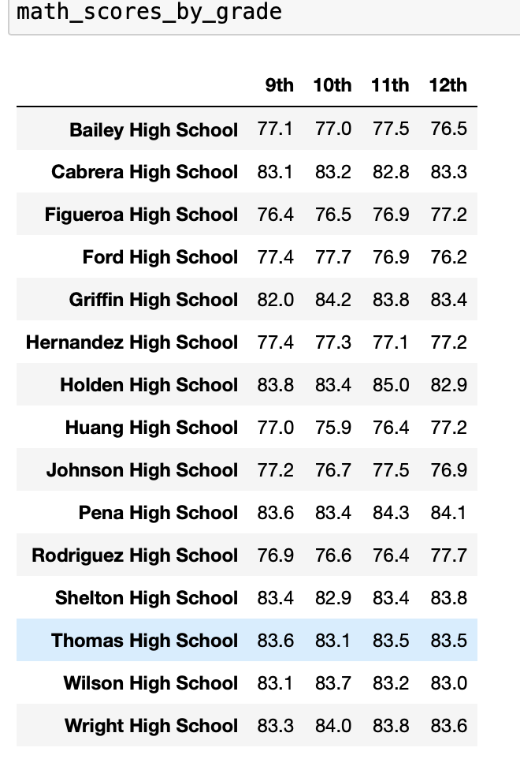 

        **Modified Math Scores by Grade**
        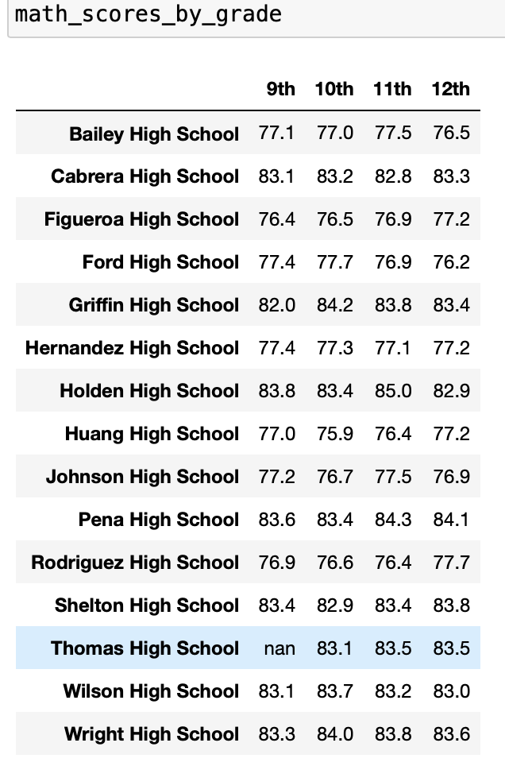 

    

    * Scores by school spending

    Scores by school spending ranges are unaffected between the original analysis and the analysis modified to remove Thomas High School 9th graders

    **Original Scores by School Spending**
    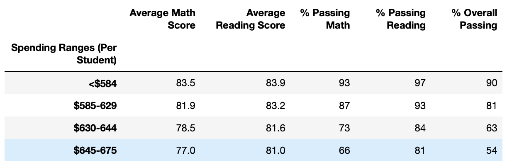 

    **Modified Scores by School Spending**
    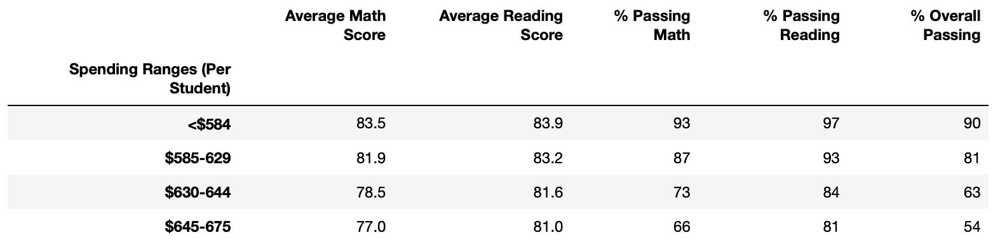 
        
    * Scores by school size are unaffected between the original analysis and the analysis modified to remove Thomas High School 9th graders

    
    **Original Scores by School Size**
    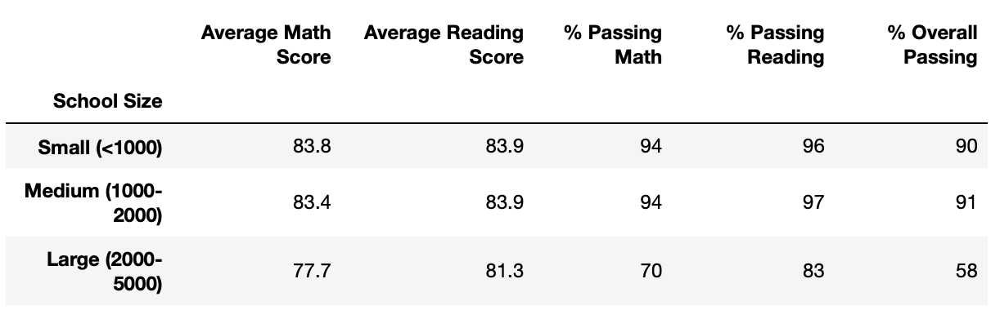 

    **Modified Scores by School Size**
    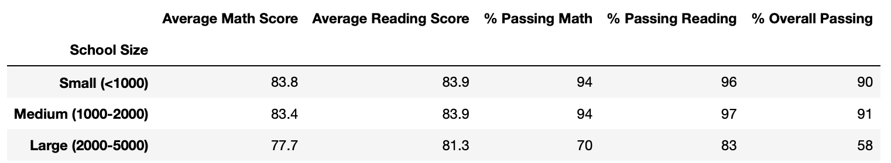 

    * Scores by school type are unaffected between the original analysis and the analysis modified to remove Thomas High School 9th graders

    **Original Scores by School Type**
    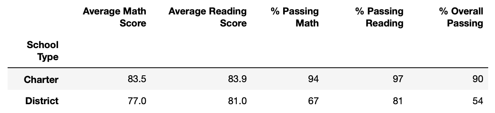 

    **Modified Scores by School Type**
    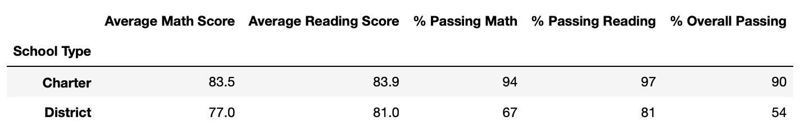 

## Summary: 

The major changes in the modified school district analysis after the Thomas High School 9th graders data is removed, are:

* At the District level, the percentage of students passing math, reading and passing both decreased marginally, which indicates that Thomas High School 9th graders' scores had been moving the district wide average higher
* The percentage of Thomas High School students Passing Math decreased from 93.27 to 66.91
* The percentage of Thomas High School students Passing Reading decreased from 97.30 to 69.66
* The percentage of Thomas High School students' Overall Passing percentage decreased from 90.94 to 65.07
* Average Math scores for Thomas High School students decreased marginally, from 83.41 to 83.35, which indicates 9th graders had above average math scores compared to the rest of Thomas High School students
* Average Reading scores for Thomas High School students increased marginally, from 83.83 to 83.89, which indicates Thomas High School 9th graders' scores were lowering the average reading scores for the whole school

 